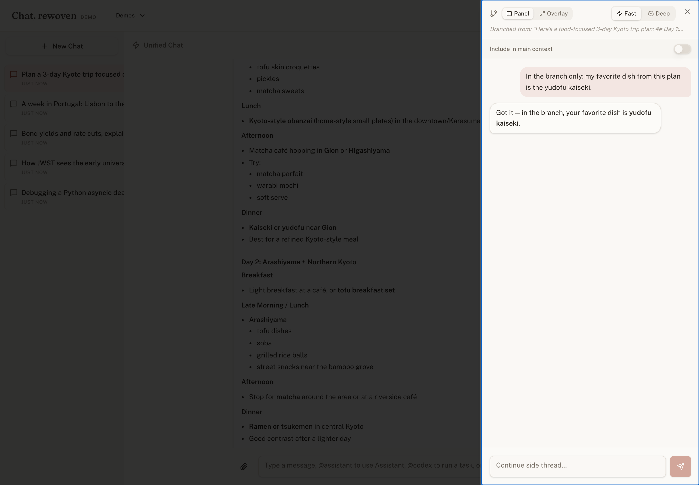
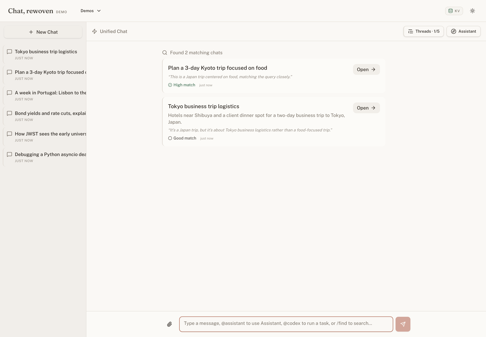
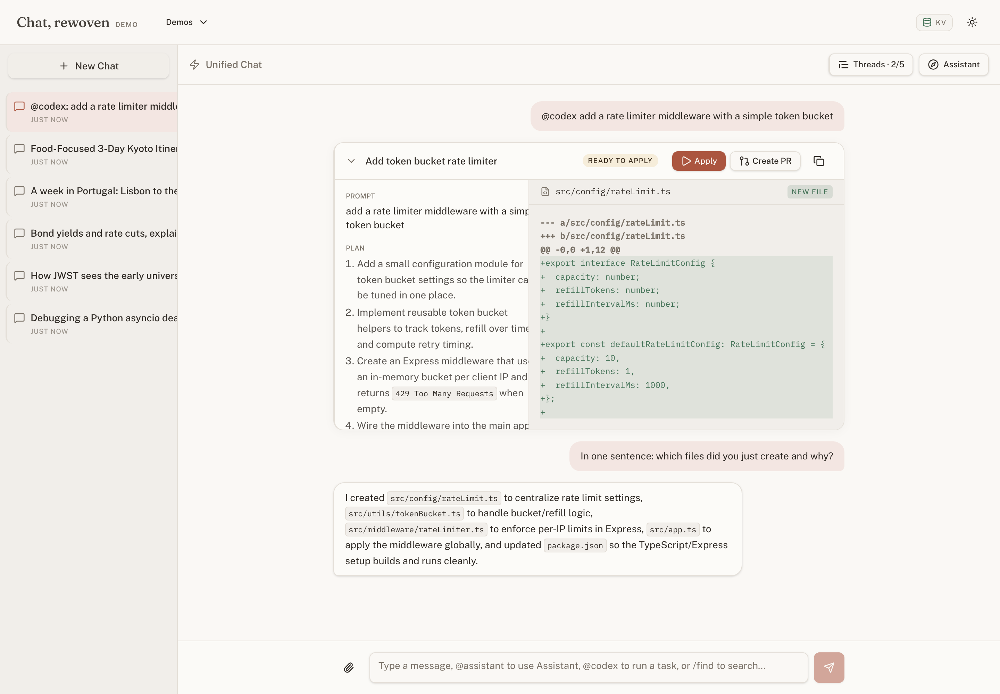

# Chat, rewoven

*A working concept for the next iteration of the ChatGPT interface — branching, history, code tasks, documents, and an assistant, woven into one chat.*

A demo, not a product. The point is the argument it makes about interface design.


*A branch: a side conversation that lives next to the thread it forked from — and can rejoin it.*

## Why this exists

ChatGPT began as one chat box. Since then, code generation became Codex, custom assistants became GPTs, and files, voice, and research each arrived with a mode or surface of their own. Every one of those launches made sense on its own terms. The sum, though, is a product where the user does the integration — you carry context from surface to surface in your head, or you paste it.

The bet here is that most of that integration work belongs to the interface. I used one test for every feature: does it get *better* because it lives inside the conversation? Branching passes — a side thread is only worth having if it can rejoin the thread it left. Code tasks pass — the value is that the chat can talk about the code afterward. Plenty of things fail the test, and they aren't here. Five ideas passed. This repo is what they look like sharing one chat.

## Try it

**Live demo:** [chat-rewoven.vercel.app](https://chat-rewoven.vercel.app)

The empty state offers example prompts that run themselves, a few sample chats are pre-seeded so history has something in it, and a quiet `Threads · 0/5` pill in the header keeps score of which of the five ideas you've tried. A tour, if you want one:

1. Click the first example prompt. When the reply finishes streaming, branch from it, tell the branch a secret, and close it with merge **on**.
2. Ask the main chat about the secret. It knows — the merge is part of the conversation chain now, and it survives a reload.
3. Type `/find the chat about the telescope`. Ranked results come back with a reason and a confidence label each; click one to open it.
4. Run `@codex` with any small feature request, then ask a follow-up question about the code it produced. No pasting.
5. Attach a PDF — or use the built-in sample — and say "read this to me."
6. Ask `@assistant what did I leave unfinished this week?` and watch it work across your chats rather than inside one.

## The five ideas

**Branching & context control.** Exploring a tangent mid-conversation usually means derailing the thread or losing the tangent. A branch forks from any reply into a side thread on the same screen, and the isolation is real: the main chat doesn't know what happened in a branch until you merge it back — as a summary or in full — at which point the merged context becomes a durable part of the conversation, not a UI illusion. The decision to merge comes *after* the exploring, which is the only time you actually know whether it was worth keeping.

**History you can actually ask for.** Chat history is usually a graveyard with a title search. Threads here name and summarize themselves, get sorted into stacks automatically, and `/find` takes the question the way you'd ask a person — "the chat about the telescope" — returning ranked candidates, each with a stated reason and a confidence tier, so you can see *why* it thinks the top result is the one.


*`/find` distinguishes the right chat from the near-misses, and says why.*

**Codex-style task cards.** Code in a chat bubble is prose pretending to be a deliverable. `@codex` runs the task in a card instead — plan, per-file diffs, apply, PR — and when it completes, the work is folded into the conversation's context. The message after the card can ask "which files did you create and why?" and get a real answer, because the chat and the task share one memory.


*The card is the deliverable; the chat around it stays fluent in what was built.*

**Documents & voice.** An attached file shouldn't become an inert blob. A PDF or DOCX here stays conversational — ask it questions, or say "read this to me" and audio streams in as it's generated, through a player that stays pinned to that message in the thread (and is still there after a reload).

**A cross-chat Assistant.** The other four ideas live inside one conversation; this one deliberately works across all of them. `@assistant` finds unfinished threads, synthesizes several chats into a downloadable artifact, or drafts the follow-up Codex prompt you were going to write — and it cites the specific chats it drew from, so the output is checkable instead of asserted.

## How it's built

Next.js 16 (App Router), TypeScript throughout. Every model call goes through the OpenAI Responses API: conversation chaining via `previous_response_id`, structured outputs for classification and ranking, SSE streaming for the chat itself. One model — `gpt-5.4-mini` — runs the entire app, differentiated by per-task reasoning effort rather than a fleet of specialized models. Voice is `gpt-4o-mini-tts`. Storage is Redis (Upstash or Vercel KV) with an in-memory and browser-session fallback, so a missing database degrades the demo instead of breaking it. The hosted demo rate-limits per anonymous session. A Playwright harness under `tests/ux` drives every core flow against network fixtures, producing step-by-step screenshots — the UI gets reviewed the way users see it, not just type-checked.

Some things are deliberately out of scope, not accidentally missing: "Create PR" is simulated end-to-end, identity is an anonymous cookie, and the Codex workspace is a mock file tree. The interface pattern is the thing under test — the backend it would eventually need is a known quantity.

## Run it locally

```bash
git clone https://github.com/soltraveler-sri/chat-rewoven-demo.git
cd chat-rewoven-demo
npm install
cp .env.example .env.local   # add OPENAI_API_KEY
npm run dev
```

Open `http://localhost:3000`. One env var is required (`OPENAI_API_KEY`); everything else has working defaults. Redis is optional locally — the app runs on an in-memory store. For a hosted deployment, add one Redis env pair so history survives serverless cold starts; `.env.example` documents everything.

## Design

The visual identity is called Interlace. It isn't decoration on top of the product — it's the product's own idea, expressed as color and type. The app's native vocabulary is thread, branch, merge; the design inherits that as principle rather than illustrating it as motif: a warm-linen light theme, a warm-charcoal dark theme, and a single terracotta accent that appears only at context events — a branch merging, a task completing, a result surfacing. Both themes were designed on purpose; neither is the afterthought.

---

Standalone, single-feature versions live at `/demos/branches`, `/demos/history`, and `/demos/codex`. Detailed walkthroughs are in [`docs/demo-guide.md`](docs/demo-guide.md).

MIT licensed. See [`LICENSE`](LICENSE).
