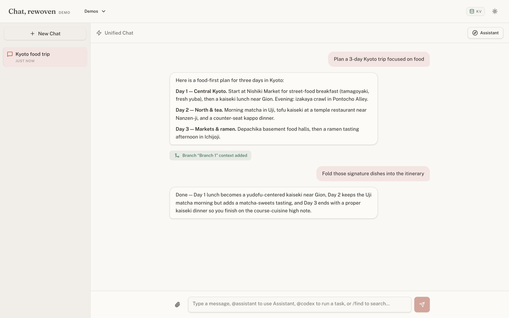
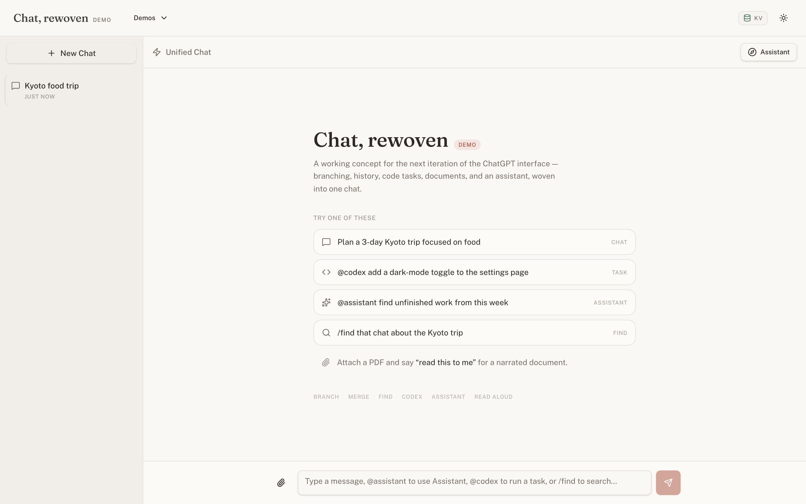
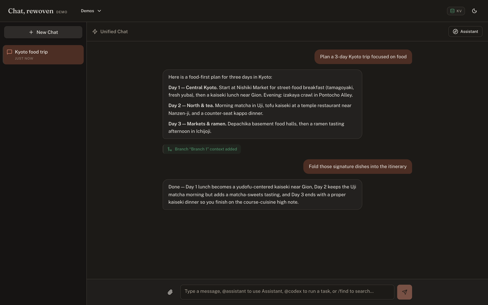

# Chat, rewoven

*A working concept for the next iteration of the ChatGPT interface — branching, history, code tasks, documents, and an assistant, woven into one chat.*

This is a demo, not a product — built to make an argument about interface design, not to ship.


*The unified chat at `/`: a conversation where a side branch's context has been merged back in — and the next reply uses it.*

## Why this exists

OpenAI's product has quietly become several products. Chat lives in its own app. Code generation lives in Codex. Custom behavior lives in GPTs. File analysis, voice, memory — each one arrived as its own surface, its own mental model, its own tab. That's a reasonable way to ship fast. It's a worse way to think, because every surface switch is a tax on the user: re-explain context, lose the thread, remember where you left something.

This demo asks a narrower question: how much of that scattered space can be woven back into the chat itself, without the chat collapsing under its own cleverness? The answer isn't "everything belongs in the thread." A feature earns its place here only if being *in* the conversation is what makes it work — branching only matters because it can rejoin the thread it left; a code task only matters if the chat can talk about it afterward; a document only matters if you can ask about it instead of switching to a viewer. Five ideas passed that bar. Plenty of others didn't make the cut, and that filter is itself the point being made.

## Try it

**Live demo:** [chat-rewoven.vercel.app](https://chat-rewoven.vercel.app)

A 60-second tour, in order:

1. Send a prompt from the empty-state suggestions and watch the reply stream in.
2. Hover the reply and click **branch from here**. Tell the branch a secret. Close it with merge off — the main chat won't know it happened.
3. Reopen the branch, turn merge on, close it again. Ask the main chat about the secret — now it knows, because the merged context survives in the conversation chain.
4. Type `/find` followed by a few words about an earlier chat and open the result it surfaces.
5. Type `@codex` followed by a small feature request. Watch the task card build a plan and a diff, then ask the chat a follow-up question about what it just generated.
6. Attach a PDF and say "read this to me" — audio streams in as it's generated, with a player that stays in the thread.
7. Type `@assistant find unfinished work from this week` and see it reason across your other chats.

## The five ideas

**Branching & context control.** Exploring a tangent in a live chat forces a choice between derailing the main thread or losing the tangent entirely. A branch lets you fork from any assistant reply, go explore, and decide afterward — not before — whether that exploration belongs in the main record, as a summary or as the full transcript. Merges are chained through the OpenAI Responses API's `previous_response_id`, so a merged branch is still there after a reload, not just in memory.

**Persistent history that's actually retrievable.** History is only useful if you can find something in it later, and "search" usually means grep-ing titles you didn't write. Threads here title and summarize themselves, Smart Stacks groups them into categories automatically, and `/find` answers a natural-language question like "that chat about the Kyoto trip" with ranked results, each carrying a plain-language reason it matched and a confidence label (high / good / possible match).

**Codex-style task cards.** Asking an assistant to write code and getting back a wall of text in a chat bubble is a bad review experience. `@codex` in the chat spawns a task card with a plan, a per-file diff, and an apply-to-workspace step — code review, not code prose. Once a task completes, it's folded back into the chat's context automatically, so the next message can ask about the code it just wrote without re-pasting anything.

**Documents & voice.** Attaching a file to a chat usually means the file becomes inert — a static object the model glances at once. Here a PDF or DOCX stays part of the conversation: ask questions about it, or say "read this to me" and it streams as narrated audio in a persistent in-chat player, rather than waiting on a full file to render before playback starts.

**A cross-chat Assistant.** Every other feature here works inside one conversation. This one deliberately doesn't: `@assistant` reasons across all of your chats at once — surfacing unfinished threads, synthesizing several conversations into a downloadable artifact, drafting a follow-up Codex prompt — with cited sources back to the specific chats it drew from, so its answers are checkable rather than asserted.

|  |  |
|---|---|
|  |  |
| Landing, light | Chat, dark |

## How it's built

Next.js 16 (App Router) and TypeScript throughout. Every model call goes through the OpenAI Responses API — conversation chaining via `previous_response_id`, structured outputs for classification and Smart Stacks, and SSE token streaming for the chat itself. One model, `gpt-5.4-mini`, handles every task in the app; the differentiation is per-task reasoning effort (chat runs medium, background classification runs low), not a fleet of different models. Voice uses `gpt-4o-mini-tts`. Storage is Redis (Upstash or Vercel KV, whichever env pair is set) with an in-memory and browser-session fallback, so a missing database degrades the demo rather than breaking it. The hosted demo rate-limits per anonymous session.

A few things are deliberately out of scope for a demo, not accidentally missing: Codex's "Create PR" is simulated end-to-end (no GitHub API call), identity is an anonymous cookie rather than an account system, and the Codex workspace is a mock file tree rather than a real repository. Each of those is a scope line drawn on purpose — the interface pattern is the thing being tested, not the backend it would eventually need.

## Run it locally

```bash
git clone https://github.com/soltraveler-sri/Improved_LLM_Chat_Demo.git
cd Improved_LLM_Chat_Demo
npm install
cp .env.example .env.local   # add OPENAI_API_KEY
npm run dev
```

Open `http://localhost:3000`. Storage and models both have working defaults — Redis is optional locally (the app runs on an in-memory store), and every model is optional to override (see `.env.example` for the full list).

For a hosted deployment, add one Redis env pair (Upstash or Vercel KV naming both work) so history survives serverless cold starts — see `.env.example` for the exact variables.

## Design

The visual identity is called Interlace, and it isn't a decoration on top of the product — it's the same idea as the product, expressed as color and type. The app's own vocabulary is thread, branch, merge; the design system inherits that vocabulary rather than illustrating it. Two themes exist because both were designed with intent, not because dark mode is expected: a warm-linen light theme and a warm-charcoal dark theme (deliberately not the default blue-gray), with one terracotta accent reserved for context-event moments — a branch merging, a document attaching, a search result surfacing.

---

Standalone, single-feature versions of each idea live at `/demos/branches`, `/demos/history`, and `/demos/codex`, if you want to see one in isolation before seeing it woven in. Detailed walkthroughs for all of these, including exact UI copy, are in [`docs/demo-guide.md`](docs/demo-guide.md).

MIT licensed. See [`LICENSE`](LICENSE).
